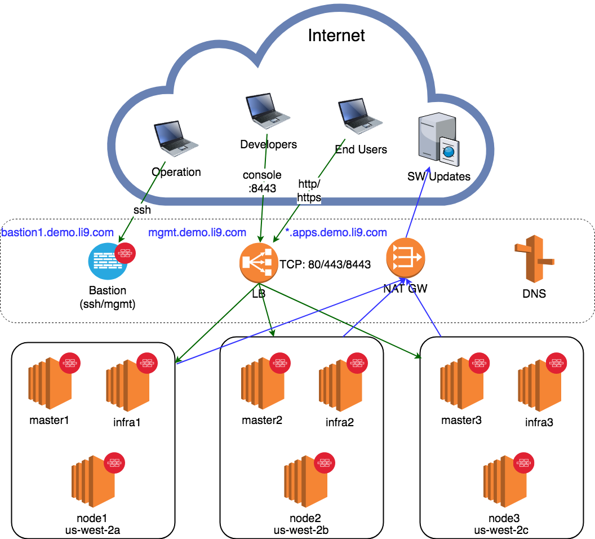

Terraform configuration for deploying OpenShift on AWS


# Preface
This project brings Openshift Container Platform v3.9 in AWS up and running in an Automated manner.

If you follow along, you should be able to successfully
- Prepare and brings up AWS virtual infrastructure via Terraform.
- Prepare AWS Bastion and OpenShift nodes 
- Install OpenShift Container Platform 3.9 on AWS on RHEL7.5


# Artchitecure
The Architecture looks like the following:



# Requirements
- Valid AWS account with Admin priviledges
- Valid Red Hat Enterprise Openshift Subscription

# Automated scripts
If you do not want to read the details of this project and just get things done, then follow the procedure below:

- in openshift.tf specify the following credentials:
    - access_key - AWS API ACCESS KEY
    - secret_key - AWS API SECRET KEY
- in variables.tf, you will need to specify the following variables:
    -  zone_id - DNS zone id in AWS to create required records
    -  dns_prefix - DNS prefix for OpenShift nodes

*You can adjust other variables if you want*

```
terraform init 
terraform plan
terraform apply --auto-approve
terraform show
ansible-playbook bastion.yml
```

**While running ansible-playbook** you will be asked to provide Redhat valid credentials to attach and download required packages, AWS API SECRET and ACCESS KEYS and DNS_PREFIX to generate lets encrypt certificates and create AWS instances with the right FQDN.

---
## Terraform
Terraform is an orchestration platform by HashiCorp that is used in this project to bring virtual environment up in AWS. 

Files used for terraform project:
- openshift.tf - instructions file for terraform
- variables.tf - variables for terraform project

Resources provisioned in this project by Terraform:
- aws_lb
- aws_lb_target_group
- aws_lb_target_group_attachment
- aws_lb_listener
- aws_security_group
- aws_vpc
- aws_subnet
- aws_internet_gateway
- aws_route_table
- aws_eip
- aws_nat_gateway
- aws_route_table_association
- aws_key_pair
- aws_instance
- aws_route53_record


In order to use terraform, you need to install terrafrom on your laptop, and then initialize and apply terrafrom files.

Initialize terraform project:
```
terraform init
```

Prepare terraform project for execution:
```
terraform plan
```

Run terraform project to build AWS intrastructure:
```
terraform apply -auto-approve
```

Once AWS infrastructure is provisioned, you can verify it by running: 
```
terraform show
```
and 
```
terraform state list
```
---
In case if you need to delete AWS controlled by terraform, use the following command:
```
terraform destroy -force
```

## Ansible
Ansible is a configuration tool by Red Hat that is being used in this project for:
- prepare AWS Bastion and OpenShift instances ready
- installing OpenShift Container Platform 3.9

Files used in this project located in **ansible** folder:
- bastion.yml - main file configures Bastin host and trigger openshift node preparation and deployment.
- prepare_openshift_hosts.yml - 
- hosts_3.9 - inventory file for Openshift Deployment based on version 3.9

To get things started run the following command:  
```
ansible-playbook bastion.yml
```

After the installation. You should have your OpenShift Container Platform 3.9 Cluster up and running. 
Open your browser and naviage to console.{{DNS_PREFIX}}, where domain prefix that you specified by running **ansible-playbook bastion.yml**.

Application deployment on Openshift goes beyond the scope of this project.
